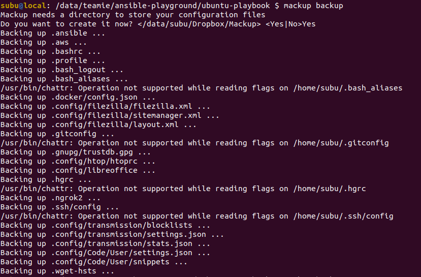
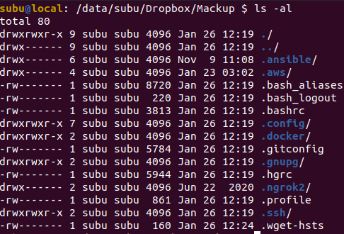

# ubuntu-playbook

Laptop setup with all software and packages.

## Configurations

Need to change the following configurations in ansible.cfg depending on which user we are going
to use and the common shared roles path.

```
ansible_become_password = subu
roles_path = /data/subu/ansible/shared_roles
```

## Dependencies

```
ansible-galaxy install staticdev.brave
```

## Setup

1. Need to install ansible after the OS is installed and setup
2. Run the playbook

```
ansible-playbook ubuntu-playbook.yml --ask-become-pass
```

## After setup

1. To restore the config stored in Dropbox. To do this after Dropbox folder gets synced locally.

   ```
   makup restore
   ```

   

   This is how files will be stored in Dropbox

   

2.
